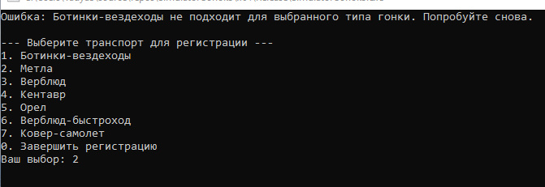

# Курсовой проект «Симулятор гонок»
1)Начало программы и выбор типа гонки

2)Указываем длину дистанции

3)Нужно выбрать минимум 2х участников, соответсвующих типу гонки

4)Наземный транспорт  не подходит для данного типа гонки

5)Выбираем подходящих участников

6)Невозможно зарегистрировать 2 одинаковых участника

7)Результат/повторить гонку или закончить

